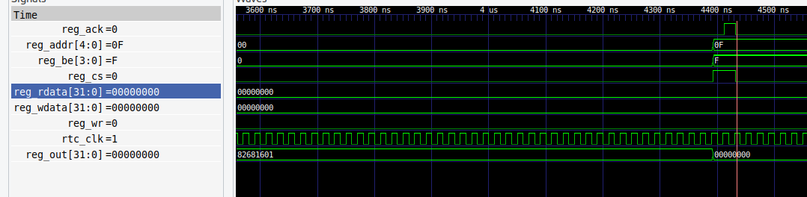
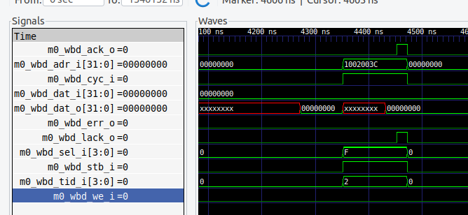
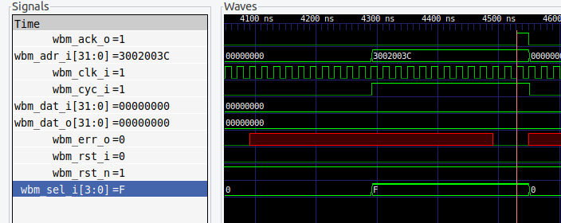

## Common Interfaces in SOC Level


### Reg Bus Interface

IO or peripherals could be configured by wishbone bus. Below is the common register bus interface. reg_cs is 'chip select'. reg_be is 'byte enable'. 
reg_ack is pulled up in the second cycle when reg_rdata is ready, then pulled down. 

```
input logic           reg_cs               //register chip select
input logic           reg_wr,              //write enable
input logic [3:0]     reg_addr,            //register address
input logic [31:0]    reg_wdata,           //register write data
input logic [3:0]     reg_be,              //register byte enable

// Outputs
output logic [31:0]   reg_rdata,           //register read data
output logic          reg_ack,             //register acknowledge
```

example: reg bus interface in pinmux 



### Wishbone Interface

```
input   wire                       wb_clk_i        ,  // System clock
input   wire                       wb_rst_i        ,  // Regular Reset signal
input   wire                       wbs_cyc_i       ,  // strobe/request
input   wire                       wbs_stb_i       ,  // strobe/request
input   wire [WB_WIDTH-1:0]        wbs_adr_i       ,  // address
input   wire                       wbs_we_i        ,  // write
input   wire [WB_WIDTH-1:0]        wbs_dat_i       ,  // data output
input   wire [3:0]                 wbs_sel_i       ,  // byte enable
output  wire [WB_WIDTH-1:0]        wbs_dat_o       ,  // data input
output  wire                       wbs_ack_o       ,  // acknowlegement
```

example: master 0 interface in wb_interconnect


example: wishbone master in wb_host



Generated by o1:
Introduction to Wishbone Bus Signals
Before diving into the signal diagrams, let's briefly recap the role of each signal:

wbs_cyc_i: Cycle signal indicating a valid bus cycle.
wbs_stb_i: Strobe signal indicating a valid data transfer cycle.
wbs_adr_i: Address bus carrying the address of the data.
wbs_we_i: Write enable signal (1 for write, 0 for read).
wbs_dat_i: Data input bus carrying data from master to slave (used in write cycles).
wbs_sel_i: Select signals indicating which bytes of the data bus are valid.
wbs_dat_o: Data output bus carrying data from slave to master (used in read cycles).
wbs_ack_o: Acknowledge signal from slave indicating the completion of a bus cycle.
Timing Diagram for a Write Cycle
Let's consider a write operation where the master writes data to the slave. Below is the timing diagram representing the signals during the write cycle.

Signal Timing Table for Write Cycle
Clock Cycle	wbs_cyc_i	wbs_stb_i	wbs_we_i	wbs_adr_i	wbs_dat_i	wbs_sel_i	wbs_ack_o
0	0	0	X	X	X	X	0
1	1	1	1	ADDR	DATA	SEL	0
2	1	1	1	ADDR	DATA	SEL	1
3	0	0	X	X	X	X	0
Explanation
Cycle 0:
All signals are idle.
wbs_cyc_i and wbs_stb_i are low (0), indicating no bus activity.
wbs_we_i, wbs_adr_i, wbs_dat_i, and wbs_sel_i are undefined or idle (X).
Cycle 1 (Start of Write Cycle):
Master initiates a write cycle.
wbs_cyc_i is asserted high (1) to indicate a valid bus cycle.
wbs_stb_i is asserted high (1) to indicate a valid data transfer.
wbs_we_i is asserted high (1) to indicate a write operation.
wbs_adr_i is set to the target address (ADDR).
wbs_dat_i is set to the data to be written (DATA).
wbs_sel_i is set to select the valid byte lanes (SEL).
wbs_ack_o remains low (0) as the slave has not yet acknowledged.
Cycle 2:
Slave processes the write request.
Signals from the master remain stable (wbs_cyc_i, wbs_stb_i, wbs_we_i, wbs_adr_i, wbs_dat_i, wbs_sel_i).
wbs_ack_o is asserted high (1) by the slave to acknowledge the write operation is complete.
Cycle 3 (End of Write Cycle):
Master terminates the write cycle.
wbs_cyc_i and wbs_stb_i are deasserted to low (0), indicating the end of the bus cycle.
wbs_we_i, wbs_adr_i, wbs_dat_i, and wbs_sel_i return to idle (X).
wbs_ack_o is deasserted to low (0) by the slave.
Timing Diagram for a Read Cycle
Now, let's consider a read operation where the master reads data from the slave.

Signal Timing Table for Read Cycle
Clock Cycle	wbs_cyc_i	wbs_stb_i	wbs_we_i	wbs_adr_i	wbs_sel_i	wbs_dat_o	wbs_ack_o
0	0	0	X	X	X	X	0
1	1	1	0	ADDR	SEL	X	0
2	1	1	0	ADDR	SEL	DATA	1
3	0	0	X	X	X	X	0
Explanation
Cycle 0:
All signals are idle.
wbs_cyc_i and wbs_stb_i are low (0), indicating no bus activity.
wbs_we_i, wbs_adr_i, and wbs_sel_i are undefined or idle (X).
Cycle 1 (Start of Read Cycle):
Master initiates a read cycle.
wbs_cyc_i is asserted high (1) to indicate a valid bus cycle.
wbs_stb_i is asserted high (1) to indicate a valid data transfer.
wbs_we_i is deasserted low (0) to indicate a read operation.
wbs_adr_i is set to the target address (ADDR).
wbs_sel_i is set to select the valid byte lanes (SEL).
wbs_dat_o is undefined or idle (X).
wbs_ack_o remains low (0) as the slave has not yet acknowledged.
Cycle 2:
Slave responds with the requested data.
Signals from the master remain stable (wbs_cyc_i, wbs_stb_i, wbs_we_i, wbs_adr_i, wbs_sel_i).
wbs_dat_o is set to the data read from the address (DATA).
wbs_ack_o is asserted high (1) by the slave to acknowledge that valid data is available.
Cycle 3 (End of Read Cycle):
Master terminates the read cycle.
wbs_cyc_i and wbs_stb_i are deasserted to low (0), indicating the end of the bus cycle.
wbs_we_i, wbs_adr_i, and wbs_sel_i return to idle (X).
wbs_dat_o is undefined or idle (X).
wbs_ack_o is deasserted to low (0) by the slave.
Visual Representation
Here's a simplified textual representation of the signals over time for both cycles. The arrows (↑ and ↓) indicate rising and falling edges.

Write Cycle Signal Waveforms
latex

Copy
Time         |--- Cycle 1 ---|--- Cycle 2 ---|--- Cycle 3 ---|
----------------------------------------------------------------
wbs_cyc_i    _____↑^^^^^^^^^^^^^^^^^^^↓_____
wbs_stb_i    _____↑^^^^^^^^^^^^^^^^^^^↓_____
wbs_we_i     _____↑^^^^^^^^^^^^^^^^^^^^_____
wbs_adr_i    ------------ADDR----------------
wbs_dat_i    ------------DATA----------------
wbs_sel_i    ------------SEL-----------------
wbs_ack_o    -----------0--------------↑1↓---
Read Cycle Signal Waveforms
brainfuck

Copy
Time         |--- Cycle 1 ---|--- Cycle 2 ---|--- Cycle 3 ---|
----------------------------------------------------------------
wbs_cyc_i    _____↑^^^^^^^^^^^^^^^^^^^↓_____
wbs_stb_i    _____↑^^^^^^^^^^^^^^^^^^^↓_____
wbs_we_i     _____↓_________________________
wbs_adr_i    ------------ADDR----------------
wbs_sel_i    ------------SEL-----------------
wbs_dat_o    -----------------------DATA-----
wbs_ack_o    -----------0--------------↑1↓---
Notes
X in the tables denotes that the signal is undefined or not relevant in that context.
The master should keep wbs_cyc_i and wbs_stb_i asserted until it receives wbs_ack_o from the slave.
The slave uses wbs_ack_o to indicate to the master that it has completed the operation.
In write cycles, the data flows from the master to the slave (wbs_dat_i).
In read cycles, the data flows from the slave to the master (wbs_dat_o).
Conclusion
The timing diagrams above illustrate the interaction between the master and slave using the Wishbone bus signals you've provided. During a bus cycle, the master controls the flow by asserting wbs_cyc_i and wbs_stb_i, setting up the address, data, and control signals (wbs_adr_i, wbs_dat_i, wbs_we_i, wbs_sel_i), and waits for the slave to acknowledge with wbs_ack_o. The slave responds by processing the request and signaling completion via wbs_ack_o, and in the case of read cycles, providing the requested data on wbs_dat_o.


### picorv32_pcpi

PCPI is a kind of internal interface within the management core, the management core refers to picorv32. It is useful to debug in the picorv32. More details please go to https://github.com/YosysHQ/picorv32?tab=readme-ov-file#pico-co-processor-interface-pcpi. 


