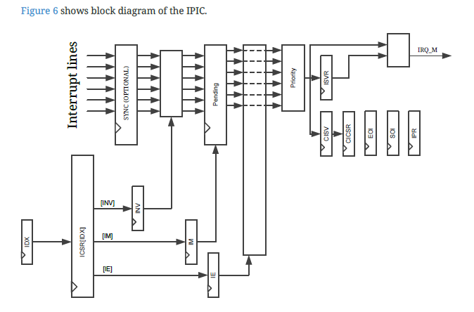

## YCR Core

### Common Link

EAS: https://github.com/syntacore/scr1/blob/master/docs/scr1_eas.pdf

### IPIC

core/pipeline/ycr_icpc.sv

This is a type of PLINT, its function is to manage the external interrupts and the interrupt in service. It is corresponding to EAS chapter 7.

```
module ycr_ipic
(
    // Common
    input   logic                                   rst_n,                  // IPIC reset
    input   logic                                   clk,                    // IPIC clock

    // External Interrupt lines
    input   logic [YCR_IRQ_LINES_NUM-1:0]          soc2ipic_irq_lines_i,   // External IRQ lines

    // CSR <-> IPIC interface
    input   logic                                   csr2ipic_r_req_i,       // IPIC read request
    input   logic                                   csr2ipic_w_req_i,       // IPIC write request
    input   logic [2:0]                             csr2ipic_addr_i,        // IPIC address
    input   logic [`YCR_XLEN-1:0]                  csr2ipic_wdata_i,       // IPIC write data
    output  logic [`YCR_XLEN-1:0]                  ipic2csr_rdata_o,       // IPIC read data
    output  logic                                   ipic2csr_irq_m_req_o    // IRQ request from IPIC
);
```

External interrupt lines corresponds to the external interrupt, for example, keyboard, mouse, etc. Another type of the interrupt is internal interrupt, or ISV, interrupt in service, those are managed by software.

```
typedef struct packed { // cp.6
    logic                                   vd;
    logic                                   idx;
} type_ycr_search_one_2_s;

typedef struct packed { // cp.6
    logic                                   vd;
    logic   [YCR_IRQ_VECT_WIDTH-1:0]       idx;
} type_ycr_search_one_16_s;

typedef struct packed {
    logic                                   ip;
    logic                                   ie;
    logic                                   im;
    logic                                   inv;
    logic                                   is;
    logic   [YCR_IRQ_LINES_WIDTH-1:0]      line;
} type_ycr_icsr_m_s;

typedef struct packed {
    logic                                   ip;
    logic                                   ie;
} type_ycr_cicsr_s;
```

vd and idx are used the prioroty encoder mentioned later, for searching the leading one position. ip means interrupt pending, ie means interrupt enable, im means interrupt mode(edge trigger or level trigger), inv means interrupt inversion, is means the current interrupt in service or not, line means the external interrupt. cicsr means current in service csr. 

```
//-------------------------------------------------------------------------------
// Local functions declaration
//-------------------------------------------------------------------------------
```
This part is to search the leading one position, it is the same as the priority encoder. 

```
//------------------------------------------------------------------------------
// IRQ lines handling
//------------------------------------------------------------------------------

`ifdef YCR_IPIC_SYNC_EN
// IRQ lines synchronization
//------------------------------------------------------------------------------

always_ff @(posedge clk, negedge rst_n) begin
    if (~rst_n) begin
        irq_lines_sync <= '0;
        irq_lines      <= '0;
    end else begin
        irq_lines_sync <= soc2ipic_irq_lines_i;
        irq_lines      <= irq_lines_sync;
    end
end
`else // YCR_IPIC_SYNC_EN
assign irq_lines = soc2ipic_irq_lines_i;
`endif // YCR_IPIC_SYNC_EN

```

This is the optional sync stage.



The following code is for interrupt level detection or edge detection. 

```
// IRQ lines level detection
//------------------------------------------------------------------------------

assign irq_lvl = irq_lines ^ ipic_iinvr_next;

// IRQ lines edge detection
//------------------------------------------------------------------------------

always_ff @(negedge rst_n, posedge clk) begin
    if (~rst_n) begin
        irq_lines_dly <= '0;
    end else begin
        irq_lines_dly <= irq_lines;
    end
end

assign irq_edge_detected = (irq_lines_dly ^ irq_lines) & irq_lvl;
```

The following, first, the reader is csr, csr read the status of IPIC. CSR needs to know a detailed information, for example, the interrupt index in the table, is the interrupt is pending, is it enabled, interrupt mode, is it in service. 
```
//------------------------------------------------------------------------------
// IPIC registers read/write interface
//------------------------------------------------------------------------------

// Read Logic
//------------------------------------------------------------------------------
```

for the write logic 
```
// Write logic
//------------------------------------------------------------------------------
// Register selection
always_comb begin
    cicsr_wr_req = 1'b0;
    eoi_wr_req   = 1'b0;
    soi_wr_req   = 1'b0;
    idxr_wr_req  = 1'b0;
    icsr_wr_req  = 1'b0;
    if (csr2ipic_w_req_i) begin
        case (csr2ipic_addr_i)
            YCR_IPIC_CISV : begin end // Quiet Read-Only
            YCR_IPIC_CICSR: cicsr_wr_req = 1'b1;
            YCR_IPIC_IPR  : begin end
            YCR_IPIC_ISVR : begin end // Quiet Read-Only
            YCR_IPIC_EOI  : eoi_wr_req   = 1'b1;
            YCR_IPIC_SOI  : soi_wr_req   = 1'b1;
            YCR_IPIC_IDX  : idxr_wr_req  = 1'b1;
            YCR_IPIC_ICSR : icsr_wr_req  = 1'b1;
            default : begin // Illegal IPIC register address
                cicsr_wr_req = 'x;
                eoi_wr_req   = 'x;
                soi_wr_req   = 'x;
                idxr_wr_req  = 'x;
                icsr_wr_req  = 'x;
            end
        endcase
    end
end
```

Quiet read means directly read from ipic2csr_rdata_o, ipic2csr_rdata_o is send directly to CSR. 

from line 395 to 607 are the action of each register, it is based on each type of register

In the CISV register, irq_serv_valid means no void interrupt vector(0x10), the idx is the vector index, which is the low 4-bit. IRQ in service is totally 16. CISV updating strategy is at the starting of the interrupt request or ending of the interrupt request.

In the CICSR register, CICSR needs to know which interrupt is currently served and the status of the current register, is it in pending or enabled.

In the EOI register, writing any value to EOI register and the irq service is valid, means the request is end of interrupt.

Down to the Priority IRQ generation acts like the same function as the functions declared in the local function. Those are to get the index parameter as the priority encoder. 


### CSR


